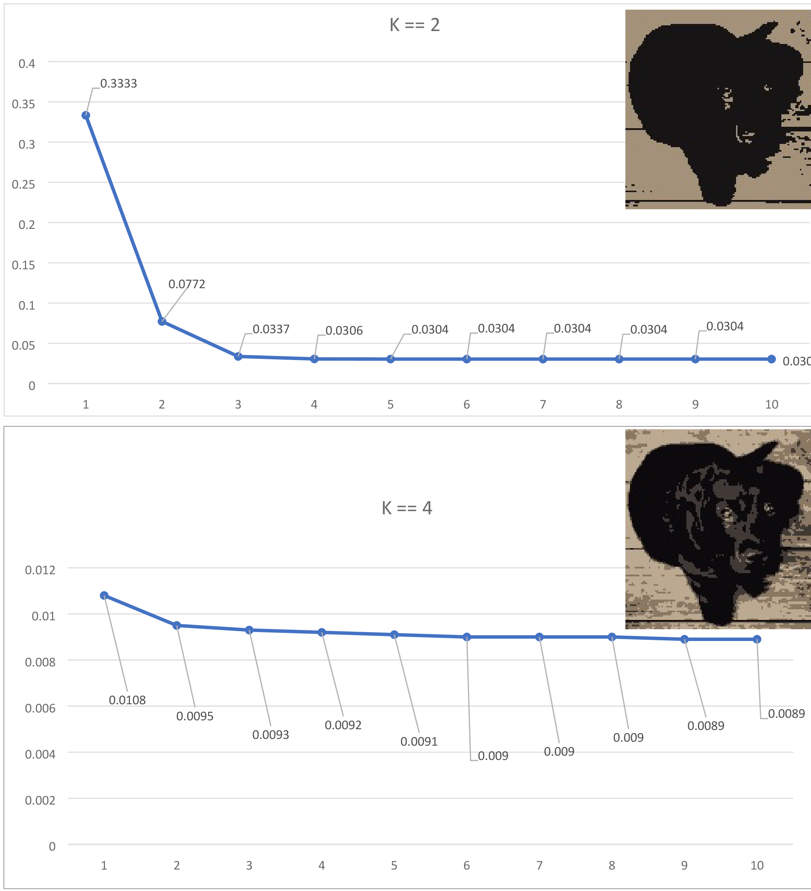
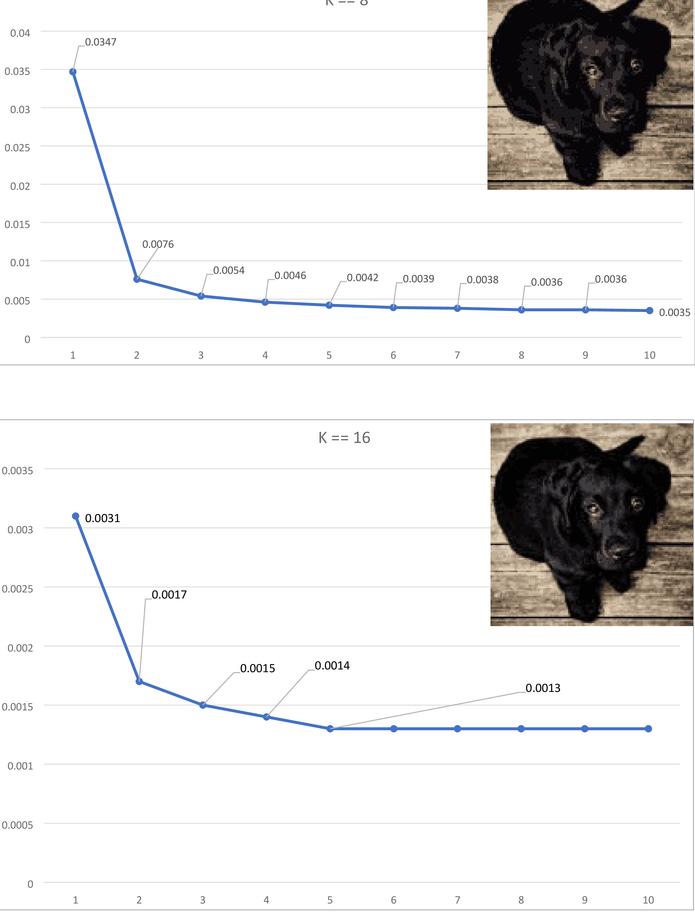

# K-Means

 K-Means implementation, first steps in ML and refresh python skills.

 Machine learning unsupervised learning, Clustering image colors, use different hyper-parameter. 

 Calculate avg loss from in every epoch, and plot convergence over iterations. 

 Run for 10 epochs for K= 2, 4, 8, 16. 
 

